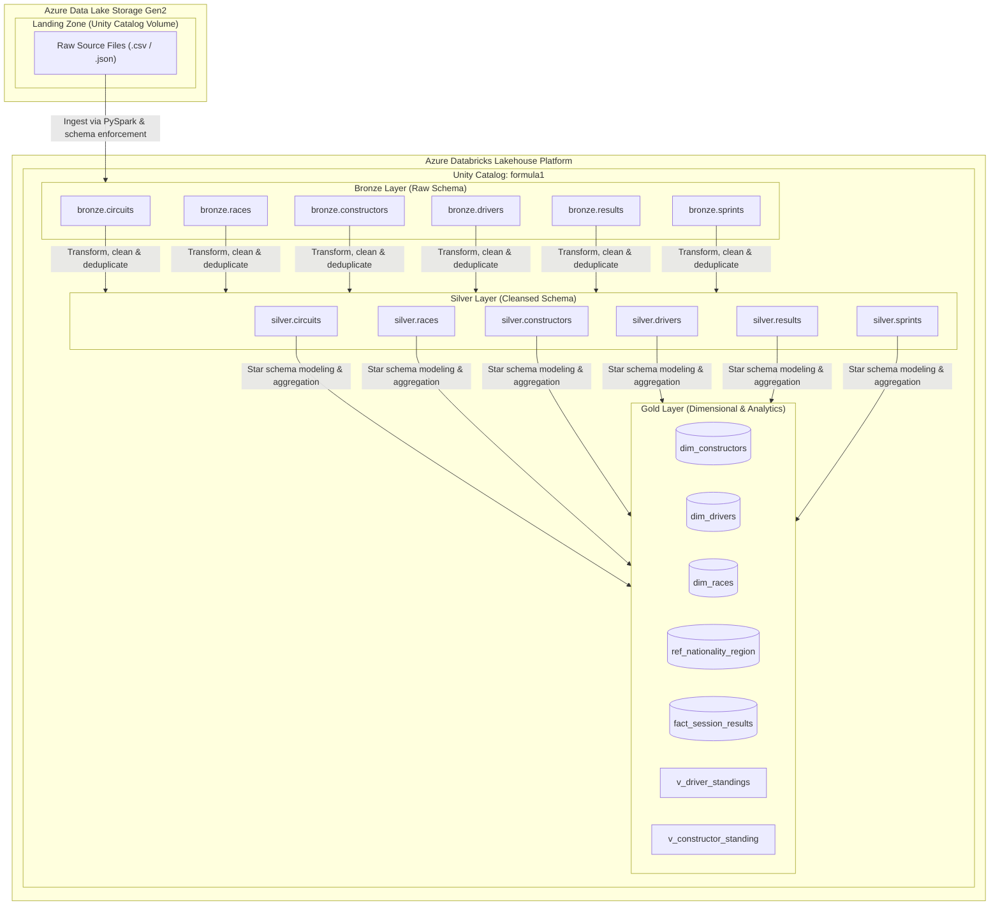

# 🏎️ Formula 1 Analytics Platform
An end-to-end Lakehouse data engineering project built with Azure Databricks, Apache Spark (PySpark), and Unity Catalog. The platform implements the Medallion Architecture (Landing $\rightarrow$ Bronze $\rightarrow$ Silver $\rightarrow$ Gold) to ingest raw Formula 1 historical datasets, apply data cleansing, build dimensional and fact models, and provide analytical views for querying team and driver dominance across seasons.

## 🏗️ Architecture Overview



## 🏅 Medallion Architecture

- **Landing Zone (UC Volume):** Raw multi-format files (circuits, races, constructors, drivers, results, sprints) staged in landing.files.
- **Bronze Layer (Raw Delta Tables):** Raw tabular representation ingested directly from landing files. Retains source-level structure with ingestion audit metadata.
- **Silver Layer (Curated Delta Tables):** Cleansed and standardized data. Handles type conversions, timestamp/date unification, schema validation, string formatting, and deduplication.
- **Gold Layer (Star Schema & Views):** Production-ready reporting layer with dimensional models (dim_drivers, dim_constructors, dim_races), reference mapping (ref_nationality_region), centralized fact metrics (fact_session_results), and analytical views (v_driver_standings, v_constructor_standing).

## 📂 Repository Structure

```
formula1-analytics/
├── 00-common/
│   ├── 01.environment-config.ipynb            # Catalog, schema & path configuration
│   └── 02.bronze-helpers.ipynb                # Ingestion helper functions & metadata logging
├── 01-setup/
│   └── 01. Setup Project Environment.ipynb    # Catalog, schemas & UC volumes setup
├── 02-bronze/
│   ├── 01. Ingest Circuits File.ipynb         # Raw ingestion for circuits
│   ├── 02. Ingest Races File.ipynb            # Raw ingestion for races
│   ├── 03. Ingest Constructors File.ipynb     # Raw ingestion for constructors
│   ├── 04. Ingest Drivers File.ipynb          # Raw ingestion for drivers
│   ├── 05. Ingest Results File.ipynb          # Raw ingestion for results
│   └── 06. Ingest Sprints File.ipynb          # Raw ingestion for sprints
├── 03-silver/
│   ├── 01. Transform Circuits Data.ipynb      # Cleansing & typing for circuits
│   ├── 02. Transform Races Data.ipynb         # Cleansing & typing for races
│   ├── 03. Transform Constructors Data.ipynb  # Cleansing & typing for constructors
│   ├── 04. Transform Drivers Data.ipynb       # Cleansing & typing for drivers
│   ├── 05. Transform Results Data.ipynb       # Cleansing & typing for results
│   └── 06. Transform Sprints Data.ipynb       # Cleansing & typing for sprints
├── 04-gold/
│   ├── 01. Build Races Dimension.ipynb        # Dim race generation
│   ├── 02. Build Constructors Dimension.ipynb # Dim constructor generation
│   ├── 03. Build Drivers Dimension.ipynb      # Dim driver generation
│   ├── 04. Build Results Fact.ipynb           # Fact session results aggregation
│   └── 91.Build Nationality Region Reference.py # Nationality lookup mapping
└── 05-analytics/
    ├── 01. Build Driver Standings View.ipynb  # Driver standings view
    ├── 02. Build Constructors Standings.ipynb # Team standings view
    ├── 03. Analyze Dominant Drivers.dbquery.ipynb # Historical driver dominancy analysis
    └── 04. Analyze Dominant Teams.dbquery.ipynb   # Historical team dominancy analysis
```

## 🛠️ Tech Stack & Data Governance

- **Platform:** Azure Databricks
- **Data Processing Engine:** Apache Spark (PySpark) & Spark SQL
- **Storage Format:** Delta Lake (ACID transactions, schema enforcement, time travel)
- **Data Governance:** Databricks Unity Catalog (formula1 catalog with managed tables and volumes)
- **Cloud Storage:** Azure Data Lake Storage Gen2 (ADLS Gen2)

## 🔄 Setup & Execution Workflow

1. **Environment Setup:** Execute 01-setup/01. Setup Project Environment.ipynb to declare the formula1 catalog, schemas (bronze, silver, gold, landing), and volume attachments.
2. **Landing Staging:** Upload the source F1 files into the formula1.landing.files volume.
3. **Bronze Ingestion:** Run notebooks under 02-bronze/ to ingest raw files into Delta tables with ingestion timestamps.
4. **Silver Curation:** Run notebooks under 03-silver/ to clean, standardize, and materialize intermediate Delta tables.
5. **Gold Modeling & Analytics:** Execute notebooks in 04-gold/ to populate dimension/fact tables, followed by 05-analytics/ for materialized views and driver/constructor dominance queries.
